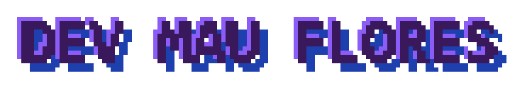
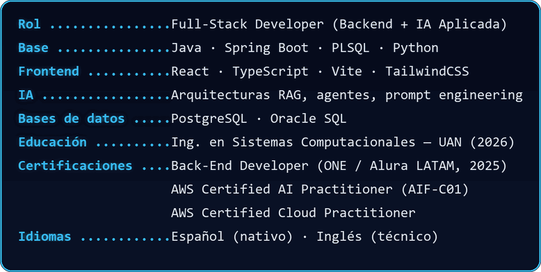
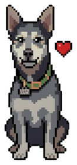
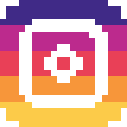
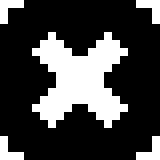

<table>
<tr>
<td width="300" valign="top" align="center">

</td>
<td valign="top">

### `Full-Stack Developer` · `Backend & IA Aplicada` · `CDMX, México`

`~/whoami`

</td>
</tr>
</table>

---

### STACK TÉCNICO

 

<table>
<tr>
<td valign="middle"><b>Lenguajes</b></td>
<td valign="middle">

</td>
</tr>
<tr>
<td valign="middle"><b>Frameworks</b></td>
<td valign="middle">

</td>
</tr>
<tr>
<td valign="middle"><b>Bases de datos</b></td>
<td valign="middle">

</td>
</tr>
<tr>
<td valign="middle"><b>APIs</b></td>
<td valign="middle">

</td>
</tr>
<tr>
<td valign="middle"><b>Autenticación y seguridad</b></td>
<td valign="middle">

</td>
</tr>
<tr>
<td valign="middle"><b>Testing</b></td>
<td valign="middle">

</td>
</tr>
<tr>
<td valign="middle"><b>IA — herramientas</b></td>
<td valign="middle">

</td>
</tr>
<tr>
<td valign="middle"><b>IA — prácticas</b></td>
<td valign="middle">

</td>
</tr>
<tr>
<td valign="middle"><b>Cloud & DevOps</b></td>
<td valign="middle">

</td>
</tr>
<tr>
<td valign="middle"><b>Herramientas & IDEs</b></td>
<td valign="middle">

</td>
</tr>
</table>

---

### PROYECTOS DESTACADOS

<table>
<tr>
<td width="90">

</td>
<td>

**Ludi Class — Plataforma LMS**
Arquitectura feature-based en React 19 + TypeScript estricto, sistema de roles (Alumno/Profesor/Admin), validación con Zod, integración con Google Apps Script como backend ligero.
`React` `TypeScript` `Vite` `TailwindCSS` · [Ver demo](https://plataforma-lms-nine.vercel.app/login)

</td>
</tr>
<tr>
<td width="90">

</td>
<td>

**GeoLead Engine**
Motor de prospección B2B geolocalizada — extracción y filtrado de leads desde Google Maps en tiempo real.
`Python` `Streamlit` `Google Maps API` · [Ver motor](https://geolead-engine-qkyer4mtkjtlukg3yek3ng.streamlit.app/)

</td>
</tr>
</table>

---

<table>
<tr>
<td width="130" valign="middle" align="center">

</td>
<td valign="top" align="center">

### 📡 SEÑAL DE HUMO — Contacto

 

<!-- Portafolio: pendiente de publicar -->

  

**Redes**

</td>
</tr>
</table>
